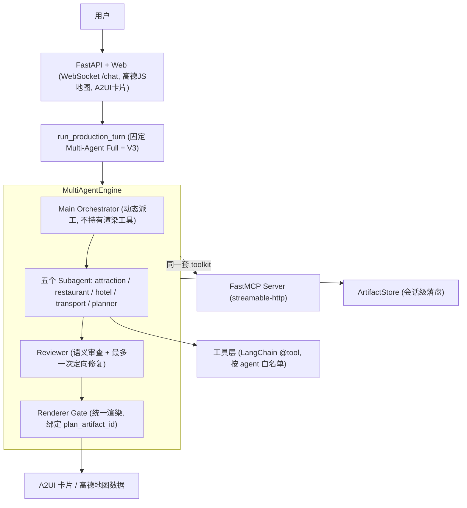

# Personalized Travel Planning Agent

基于 **LangGraph** 的多 Agent 可控旅行规划系统。

- **生产入口固定 Multi-Agent Full（V3）**：Main Orchestrator 动态派工给五个领域
  Subagent（景点 / 餐厅 / 酒店 / 交通 / 规划），Reviewer 语义审查最多一次定向
  修复周期，渲染统一由 Engine 经 Renderer Gate 执行；
- **规划核心是可控、可评估的规划子图** `plan_and_critique`（plan → critic → revise
  闭环），保证最终行程是约束满足、可执行的，而不是 LLM 一次性吐出的不可控文本；
- **V0–V3 消融对照共用同一 Engine**：同一模型 / 工具 / 数据 / Token 预算下显式
  复现四种编排版本，证明多智能体不是「为了复杂而复杂」。

> 一句话卖点：既展示 agent 能力（真实自主 tool calling + 真实 API），又展示
> 「知道何时该用确定性控制」的工程判断力（可控规划子图 + Renderer Gate + 量化评估）。

完整目标与里程碑见 [docs/PROJECT_PLAN.md](docs/PROJECT_PLAN.md)（**M0–M8 均已落地**）。

## 架构



- 无 LLM key 时，`run_production_turn` 自动降级为**确定性兜底**（复用同一套工具按固定顺序
  跑通），保证项目可离线演示；有 key 时走真正的 ReAct 自主编排。
- in-process agent 与 MCP server 共用 `travel_agent.agent.toolkit` 的同一套工具实现
  （单一事实源），避免「黑盒大工具」。

## 快速开始

### 1. 安装依赖

```bash
python3 -m venv .venv
.venv/bin/python -m pip install -e .          # 或 pip install -e ".[dev,mcp]"
```

> 国内网络可加镜像：`-i https://pypi.tuna.tsinghua.edu.cn/simple`

### 2. 配置（可选，无 key 也能离线跑）

```bash
cp config.toml.example config.toml
```

在 `config.toml` 填写：

- `[llm]`：`provider`（qwen/deepseek/openai）+ `api_key` → 启用真实 ReAct agent；
- `[amap].web_key`：高德 **Web 服务** key（后端 REST：POI/天气/路线）；
- `[amap].js_key`：高德 **JS API** key（前端地图渲染，与上面是两把不同的 key）。

环境变量优先级高于 `config.toml`（便于 CI / 临时覆盖）。

### 3. 启动 Web

```bash
PYTHONPATH=src .venv/bin/python -m travel_agent.server
# 打开 http://localhost:8000
```

浏览器里完成「多轮对话 → 工具调用 → 带 critic 修正的行程 → 地图点位与路线」。

## 工具集合（拆细，供 LLM 自主编排）

| 工具 | 作用 |
| --- | --- |
| `update_travel_profile` | 累积多轮出行画像 |
| `request_travel_info` | 信息缺失时追问 |
| `search_poi` | 检索候选 POI（高德优先，本地 seed 兜底） |
| `check_weather` | 天气（雨天户外冲突判断） |
| `plan_route` | 两点距离/通勤时长 |
| `build_constraints` | 从画像生成可验证 ConstraintSet |
| `search_restaurant` | 餐厅候选：菜系 / 区域 / 预算 |
| `search_hotel` | 酒店候选：区域 / 预算 / 评分 |
| `estimate_budget` | 住宿 / 餐饮 / 门票 / 市内交通预算估算 |
| `recommend_candidates` | 多目标打分 + 多样性重排 |
| `plan_and_critique` | **可控规划子图**：plan → critic → revise 闭环 |
| `render_itinerary` / `render_map` | A2UI 卡片 / 高德地图数据 |

## 可控规划子图（差异化核心）

`src/travel_agent/planning_subgraph.py` 用 LangGraph `StateGraph` 把现有
planner / critic / reviser 编排成有限闭环：

```text
plan -> critic -> [passed? END : revise -> critic -> ...]   (最多 max_iters 轮)
```

刻意保持**确定性**（不调用 LLM）：什么样的行程算可行、约束是否满足必须可控、
可评估。输出保留「原始稿 vs 修正稿」对比，量化 critic 的价值。

## MCP Server（工具与 agent 解耦）

```bash
# 启动 MCP server（streamable-http, 默认 8765）
PYTHONPATH=src .venv/bin/python -m travel_agent.mcp_server

# 演示：动态拉取工具并调用
.venv/bin/python scripts/mcp_client_demo.py
# -> 从 MCP Server 拉取到 9 个工具：search_poi / plan_and_critique / ...
```

## M4–M6 加分项（已实现）

### M4 三层记忆 + 会话持久化

- **L1** `MemoryCompressor`：历史超阈值时规则/LLM 压缩
- **L2** `ArtifactStore`：工具结果落盘 + 注入 system prompt 快照
- **L3** `UserProfileStore`：跨会话用户偏好（`data/profiles/`）
- `SessionLifecycleManager`：按 `session_id` 恢复历史与 artifacts（重启可续）
- `choose_memory_mode`：`full` / `compressed` / `profile_only`

### M5 分层编排（默认关闭）

`config.toml` 中 `[orchestration] layered_enabled = true` 开启：

```text
requirement → research → planning → risk → render
```

层校验失败回滚 checkpoint；指标落盘 `layer_metrics` artifact。聚合：

```bash
.venv/bin/python scripts/eval_layer_metrics.py
```

### M6 声明式 Skills

`.storyline/skills/*/SKILL.md` 启动时加载为 `skill_<id>` 工具，无需改 Python。内置：

- `full_trip_planner` / `rainy_day_alternative` / `structured_planner`

## 评估

```bash
# 规则版 workflow 评估（理解/规划/澄清）
PYTHONPATH=src .venv/bin/python scripts/run_eval.py

# Agent / 规划 / 闭环 级评估，并生成 docs/EVALUATION.md
.venv/bin/python scripts/eval_agent.py --write-report
```

评估分五层（理解 / Agent / 规划 / 闭环 / 分层），在离线确定性路径下可复现。
当前结论（小样本，已如实标注局限，见 [docs/EVALUATION.md](docs/EVALUATION.md)）：

评估分四组（理解 / Agent、ChinaTravel 式计划质量、闭环、真实多 Agent 的
agent_trace 口径），详见 [docs/EVALUATION.md](docs/EVALUATION.md)。
V2 数据集、指标、故障归因与微调门槛详见 [docs/EVALUATION_V2.md](docs/EVALUATION_V2.md)。
面试讲述稿见 [docs/INTERVIEW_PITCH.md](docs/INTERVIEW_PITCH.md)。

## 测试

```bash
.venv/bin/python -m pytest -q
```

## 旧版规则 workflow（离线兜底 / 对照）

旧的固定流水线 `run_mvp_workflow` 仍保留为无 key 时的离线兜底与评估对照：

```bash
PYTHONPATH=src .venv/bin/python demo.py "帮我规划北京两天，喜欢历史和美食，不要太累"
PYTHONPATH=src .venv/bin/python chat_demo.py
```

## 项目文档

- [开发路线与里程碑](docs/PROJECT_PLAN.md)
- [评估报告](docs/EVALUATION.md)
- [面试讲述稿](docs/INTERVIEW_PITCH.md)
- [架构设计](docs/ARCHITECTURE.md)
- [V0–V3 架构消融实验](docs/ABLATION_V0_V3.md)
- [工具接口](docs/TOOL_INTERFACE.md)
- [LLM 结构化抽取设计](docs/LLM_EXTRACTOR.md)
- [数据结构说明](docs/DATA_STRUCTURE.md)
