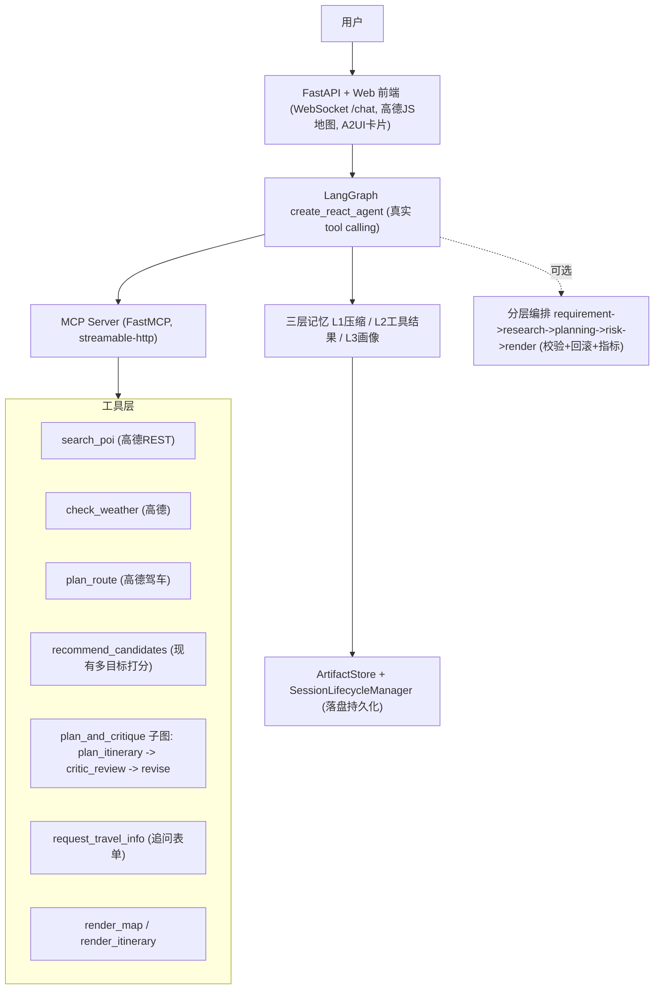

# 项目计划

> ⚠️ **状态更新（Step 4）**：本文档是 M0–M9 阶段的历史规划记录。
> 文中 M9 五层 `LayeredTravelAgent` 编排已在多 Agent 架构改造 Step 4 中
> 删除，生产链路收敛为 `MultiAgentEngine`（V0–V3 共用同一 Engine，生产入口
> 固定 Multi-Agent Full = V3），可观测性统一为 agent_trace。
> M9 历史代码保留在 git tag `m9-layered-final`。
> 现行架构见 [ARCHITECTURE.md](ARCHITECTURE.md) 与
> [ABLATION_V0_V3.md](ABLATION_V0_V3.md)。
>
> 实现模式参考 `../../TravelAgent-AI-main`（借鉴架构与模式，不照搬功能集）。

## 项目定位

项目名称：

```text
Personalized Travel Planning Agent（基于 LangGraph 的可控旅行规划 Agent）
```

目标岗位：

- AI Engineer
- LLM Application Engineer
- Agent Algorithm Engineer
- AI Algorithm Engineer

核心叙事（重写后）：

```text
我用 LangGraph 构建了一个真正自主调用工具的旅行规划 Agent：
LLM 在多轮对话中自主决定调用高德 POI / 天气 / 路线等真实工具、何时追问、
何时触发重规划；工具通过 MCP Server 动态暴露。
在 agent 的自主编排之上，我把「约束感知行程规划 + planner-critic-reviser
闭环」做成一个可控、可评估的规划子图，保证最终行程是可执行、约束满足的，
而不是 LLM 一次性吐出的不可控文本。整个系统可部署、可演示、可量化评估。
```

一句话卖点：

```text
既展示 agent 能力（真实自主 tool calling + 真实 API），
又展示「知道何时该用确定性控制」的工程判断力（可控规划子图 + 量化评估）。
```

## 需要避免的方向

不要把项目做成：

```text
1) 套了一层 LLM 的 POI 推荐系统；
2) 通用的 ReAct 旅行 demo（与参考项目同质，丢掉自己的差异化）。
```

应该始终保持主线为：

```text
真实自主 tool calling 的 Agent，内嵌可控、可评估的约束感知规划核心。
```

## Agent 定位（重要）

旧版本是一个**写死的固定流水线**（extractor → recommend → planner →
critic → reviser）。重写后的目标定位是：

- **外层（agent 主干）**：LangGraph `create_react_agent` 驱动的真正 ReAct
  循环。LLM 自主决定调用哪个工具、是否追问缺失信息、是否对行程重新规划。
  这是「真正 agent」的硬指标，必须由 LLM 自主 tool calling 驱动，而不是
  if-else。
- **内层（可控规划核心，差异化）**：把现有约束感知 planner、critic、reviser
  封装为一个**可控规划子图/工具** `plan_and_critique`，对外暴露给 agent。
  agent 决定「何时」规划，子图保证「规划质量可控、可评估、可复现」。

为什么这是工程判断力的体现（面试讲述）：

```text
旅行规划里，"决定调哪些工具/要不要追问" 适合交给 LLM 自主决策（agent）；
而 "一天能不能走完、约束有没有满足" 必须可控、可评估，不能交给 LLM 自由发挥。
所以我用真 ReAct 做编排，用确定性子图 + critic 闭环做规划质量控制。
```

**玩具陷阱（必须避免）**：不要把规划核心做成一个黑盒大工具
`plan_everything`（里面偷偷是老流水线）。工具必须拆细
（`search_poi` / `check_weather` / `plan_route` / `recommend_candidates` /
`plan_itinerary` / `critic_review` / `revise_itinerary` /
`request_travel_info`），让 LLM 真正在这些工具之间编排决策。

## 目标架构



数据流（一次完整请求）：

1. 用户在 Web 前端发起多轮对话，经 WebSocket `/chat` 进入后端；
2. 后端构建/复用会话级 agent，注入三层记忆（L1 压缩历史 / L2 已收集工具结果 /
   L3 用户长期画像）到 system prompt；
3. agent（ReAct）自主决策：信息不全则调 `request_travel_info` 追问；信息够则
   依次调 `search_poi` / `check_weather` / `plan_route` 等真实工具采集数据；
4. agent 调用可控规划子图 `plan_and_critique`：plan → critic → revise 闭环，
   产出约束满足的结构化行程；
5. agent 调 `render_map` / `render_itinerary` 生成前端地图可渲染数据；
6. 工具结果落盘为 artifact，分层编排（若开启）记录 layer 指标；
7. 前端以 A2UI 卡片 + 高德地图渲染每日行程、POI、天气、路线与 critic 说明。

## 现状 → 目标的模块改造映射

- `src/travel_agent/workflow.py`（写死流水线）→ **退役/降级为 fallback**，
  主路径换成 LangGraph agent；保留其逻辑用于无 LLM key 时的离线兜底。
- `recommendation.py` → 包装为 `recommend_candidates` 工具，保留多目标打分
  （interest/popularity/rating/pace/budget/constraint）作为亮点。
- `planning.py` + `critic.py` + `reviser.py` → 封装为可控规划子图
  `plan_and_critique`（plan → critic → revise 闭环），这是差异化核心。
- `providers.py`（Amap/Local/Fallback）→ 底层 HTTP 调用复用，上层重写为
  LangChain `@tool`：真实高德优先、本地 seed/mock 作为 fallback。
- `dialogue.py`（内存 session）→ 升级为 `ArtifactStore` +
  `SessionLifecycleManager` 持久化 + 三层记忆。
- `schemas.py` → 复用为工具入参/出参与行程结构的 pydantic 模型。
- `eval/` → 扩充为 agent 级 + 规划级 + 分层级评估脚本与报告。
- 配置：从分散环境变量统一为 `config.toml`（pydantic-settings），区分 LLM
  key、高德 Web 服务 key（REST）、高德 JS API key（前端地图）。

## 迁移路线图

排序原则：**先可演示、再加重武器**。真实工具 + 可控规划子图 + Web 优先落地，
记忆 / 分层编排 / Skills 作为加分项里程碑后置，避免一次铺太大导致烂尾。
每个里程碑都应能独立演示并留存证据（截图/录屏/日志）。

### M0：技术栈切换 + 最小可跑的 ReAct Agent

目标：先证明「LLM 真的能自主调用工具」，打通最小闭环。

改造点：

- 引入依赖：`langgraph`、`langchain`、`langchain-openai`、`pydantic-settings`；
- 新增 `config.toml`（参考 `TravelAgent-AI-main/config.toml.example`）与
  pydantic-settings 配置加载；
- 用 `create_react_agent(model, tools, prompt)` 搭最小 agent，先挂 2–3 个由
  现有逻辑包装的本地工具（如 `search_poi` 走 local seed、`plan_itinerary`）；
- LLM 用 OpenAI 兼容服务（Qwen / DeepSeek，二选一，先用便宜的）；
- 设 `recursion_limit` 防 ReAct 死循环（参考项目用 20）。

DoD：一句中文 query 进去，能在日志里看到 LLM **自主**发起 ≥1 次 tool call 并
返回结构化结果，不依赖写死的调用顺序。

### M1：真实高德工具落地 + 追问工具

目标：让工具打真实 API，坐实「真实工具调用」叙事。

改造点：

- 把 `providers.py` 的高德调用上提为 LangChain `@tool`：`search_poi`
  （`/v3/place/text`）、`check_weather`、`plan_route`（驾车路线，返回距离/
  时长/折线）；保留本地 fallback；
- 新增 `request_travel_info` 工具：信息缺失时让 agent 主动追问目的地/天数/
  预算/偏好（参考 `register_tools.py` 的 `request_travel_info`）；
- 申请并配置高德 Web 服务 key，端到端跑通一次不依赖 fallback 的真实请求。

DoD：在真实 key 下，POI / 天气 / 路线三类工具各至少一次真实请求成功，并完整
跑通一个 query；留存请求/响应样例与截图。

### M2：约束感知 planner-critic-reviser 封装为可控规划子图（差异化核心）

目标：保留并强化项目最有价值的差异化能力。

改造点：

- 把 `planning.py` / `critic.py` / `reviser.py` 封装为子图/复合工具
  `plan_and_critique`：内部 plan → critic → revise 闭环，输出约束满足的行程；
- critic 继续检查：缺字段、单日 POI 过多、路线/通勤过长、雨天户外冲突、预算/
  偏好不匹配、类型单一、must_visit 命中；
- `recommend_candidates` 工具独立暴露（多目标打分 + 多样性重排），供 agent
  在规划前调用；
- 关键：工具拆细，确保 agent 在 `recommend_candidates` → `plan_and_critique`
  之间是 LLM 自主编排，而非写死顺序。

DoD：agent 自主调用规划子图后，输出行程的 critic 违规项为 0 或可解释；能展示
「plan 原始稿 vs revise 修正稿」的差异。

### M3：MCP Server 化

目标：工具与 agent 解耦，向「可被任意 MCP 客户端复用」的工程形态靠拢。

改造点：

- 用 FastMCP 起一个 streamable-http MCP Server，把 M1/M2 的工具用
  `@server.tool` 注册（参考 `mcp/register_tools.py` 的薄包装 + artifact 持久化
  + `isError` 约定）；
- agent 侧改用 `MultiServerMCPClient.get_tools()` 动态拉取工具（参考
  `agent.py` 的 `build_agent`）；
- FastAPI 启动时在后台自动拉起 MCP Server。

DoD：agent 启动日志显示「从 MCP Server 拉取到 N 个工具」，端到端行为与 M2 一致。

### M4：三层记忆 + 会话持久化（加分项）

目标：支持多轮、跨会话记忆与可恢复的会话状态。

改造点：

- L1 `MemoryCompressor`：消息量/token 超阈值时 LLM 压缩历史；
- L2 `ArtifactStore`：本会话工具结果落盘并注入 system prompt 快照；
- L3 `UserProfileStore`：跨会话用户偏好画像；
- 按 token/消息阈值动态切换 full/compressed/profile_only（参考 `agent.py` 的
  `choose_memory_framework`）；
- `SessionLifecycleManager` 管理会话隔离与清理，替换内存版 `dialogue.py`。

DoD：重启后能按 session_id 恢复历史工具结果；长对话不超 token 上限。

### M5：分层编排 + 量化指标（加分项）

目标：把「agent 行为」变得可度量、可回归。

改造点：

- 实现 5 层编排 requirement → research → planning → risk → render，每层只暴露
  该层工具，层校验失败则回滚到最近 checkpoint 重试（参考
  `orchestration/layered_agent.py`）；
- critic 天然对应 risk 层；
- 产出 `layer_hit_rate` / `rollback_rate` / per-layer 指标并落盘为 artifact；
- 作为可配置开关（默认关闭），便于对比开/关效果。

DoD：能跑出分层指标，并用一句带数字的话说明分层编排带来的稳定性收益。

### M6：Skills（加分项）

目标：用声明式 Markdown 技能扩展能力，展示工程化扩展性。

改造点：

- 引入 `.storyline/skills` 目录与 SKILL.md（参考 `full_trip_planner` /
  `rainy_day_alternative` / `structured_planner`）；
- 启动时把 skills 作为工具动态加载进 agent。

DoD：新增一个 SKILL.md 即可被 agent 识别调用，无需改 Python 代码。

### M7：FastAPI + Web 前端 + 高德地图 + A2UI 卡片

目标：可演示入口，作品集与面试的门面。

改造点：

- FastAPI + WebSocket `/chat`（参考 `agent_fastapi.py`）：流式返回，
  `recursion_limit` / 超时保护；
- 前端 `web/`：聊天界面 + 高德 JS API 地图渲染（POI 点位、路线折线、按天分组）；
- A2UI 卡片协议（`@@A2UI@@` 事件前缀）展示 POI 卡片、天气、每日行程、critic
  说明（参考 `a2ui_cards.py` 与 `web/static`）。

DoD：浏览器里完成一次多轮对话 → 真实工具 → 带 critic 修正的行程，并在地图上
看到点位与路线。

### M8：评估报告 + 作品集包装

目标：把「可评估」从口号变成带数字的结论。

改造点：

- 输出 `docs/EVALUATION.md`：抽取层 / 规划层 / 闭环层 / agent 层 / 分层级指标；
- README 架构图（用本文 mermaid）+ 一次端到端录屏；
- 面试讲述稿：突出「真自主 tool calling + 可控规划子图 + 量化评估」三点。

DoD：能用 3 句带数字的话讲清项目价值（如「约束违规项平均下降 X%」「工具调用
成功率 Y%」「分层编排把 rollback_rate 从 A 降到 B」）。

## 评估方案

评估是本项目对外可信度的核心，单独成节。分为五层：

- **抽取/理解层**：目的地/天数/兴趣等字段抽取准确率，含噪声与模糊输入；
- **规划层（最重要）**：约束满足率、单日 POI 超载率、通勤超限率、must_visit
  命中率、雨天户外冲突率、类型多样性；
- **闭环层**：plan 原始稿 vs revise 修正稿的违规项下降幅度，量化 critic 价值；
- **Agent 层（新增）**：工具调用成功率、平均 ReAct 步数、任务完成率（是否产出
  可用行程）、追问触达率（缺信息时是否正确追问）；
- **分层编排层（新增）**：`layer_hit_rate` / `rollback_rate` / p90 / 高频失败
  层，离线脚本对齐参考项目 `scripts/eval_layer_metrics.py`（从落盘 artifact
  聚合）。

评估数据来源：

- 现有 `eval/cases.json` 为人工构造小样本，报告中**如实标注样本量与局限**；
- 后续从真实/半真实 query 扩充，避免只在自写用例上「自证好」。

## 技术栈与依赖

- Agent：`langgraph`（`create_react_agent`）、`langchain`、`langchain-core`；
- LLM：`langchain-openai`（接 OpenAI 兼容服务，Qwen / DeepSeek）；
- 工具/MCP：`fastmcp` / `mcp[cli]`、`langchain-mcp-adapters`
  （`MultiServerMCPClient`）；
- Web：`fastapi`、`uvicorn[standard]`、`python-multipart`、`aiofiles`；
- 基础：`httpx`（高德 REST）、`pydantic` v2、`pydantic-settings`、`colorlog`；
- 测试：`pytest`；
- 外部 API：高德 Web 服务 key（POI/路线/天气 REST）+ 高德 JS API key（前端地图）。

## 参考项目映射（借模式，不照搬功能）

参考 `../../TravelAgent-AI-main`，逐文件对应本项目要借鉴的模式：

- `src/travel_agent/agent.py`：`create_react_agent` 构建、`MultiServerMCPClient`
  拉取工具、动态 system prompt 拼装、三层记忆初始化、DeepSeek content 拍平
  与 `reasoning_content` 回注 → 对应 M0/M3/M4。
- `src/travel_agent/mcp/register_tools.py`：工具薄包装、session 注入、artifact
  持久化、统一 `{artifact_id, result, isError}` 返回约定 → 对应 M3。
- `src/travel_agent/nodes/core_nodes/search_poi.py`：高德 `/v3/place/text`
  解析（经纬度、photos、rating） → 对应 M1。
- `src/travel_agent/orchestration/layered_agent.py`：5 层编排、层校验、回滚
  重试、`LayerMetrics` 计算 → 对应 M5。
- `src/travel_agent/nodes/node_manager.py`：按场景标签 + 分层筛选工具 → M5。
- `src/travel_agent/storage/*`（`agent_memory` / `session_manager` /
  `memory_compressor` / `user_profile`）：三层记忆与会话持久化 → 对应 M4。
- `agent_fastapi.py` + `web/`：WebSocket `/chat`、后台拉起 MCP、A2UI 卡片、
  高德 JS 地图渲染 → 对应 M7。
- `scripts/eval_layer_metrics.py`：从落盘 artifact 聚合分层指标 → 对应 M8。
- `scripts/validate_api_keys.py`：API key 有效性校验 → 对应 M1。
- `.storyline/skills/*/SKILL.md`：声明式技能加载 → 对应 M6。

注意：参考项目里的 TTS/ASR/数字人等不在范围内；地图、A2UI、MCP、分层编排、
三层记忆是值得借鉴的模式，但实现上结合本项目的「可控规划子图」差异化，避免
做成与参考项目同质的通用 demo。

## 风险与未知项

工程/集成风险：

- LLM 成本与延迟：ReAct + 多工具调用会放大 token 与耗时，需设步数上限、超时、
  必要时缓存；
- ReAct 死循环：必须设 `recursion_limit` 并对工具失败做有限重试；
- MCP 连接稳定性：后台拉起 MCP Server 的端口冲突、超时、握手失败需兜底；
- 高德双 key：Web 服务 key（REST）与 JS API key（前端）不同，配额/计费/合规
  需注意；地名解析与 adcode 映射可能不准。

产品/数据风险：

- seed 仅 5 个城市，无真实 key 时演示其他城市会暴露空数据，需声明演示范围或
  靠真实 API 兜底；
- 会话并发与持久化：上 Web 后多用户并发、重启恢复需 `SessionLifecycleManager`
  正确隔离。

叙事风险：

- 在真实 key 端到端跑通前，不要对外声称「已在用真实工具调用」；
- 「可评估」在评估报告（M8）完成前不要作为既成卖点宣称；
- 避免把规划核心做成黑盒大工具，否则「真 agent」成色会被质疑（见 Agent 定位）。

## 各里程碑完成标准（DoD）汇总

- 每个 Mx 都有可验证 DoD（见各节），且都应能独立演示并留存证据；
- 总验收：浏览器内完成一次多轮对话 → 真实高德工具 → 可控规划子图（带 critic
  修正）→ 地图渲染，并有评估报告与录屏支撑。
